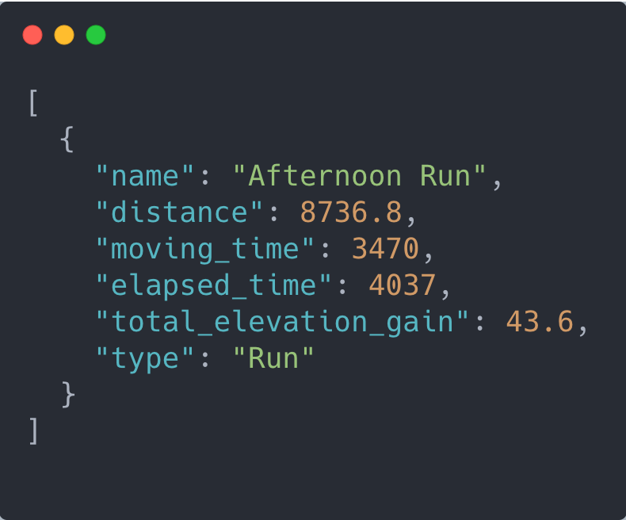

<p align="center">
  <a href="https://github.com/marketplace/actions/fetch-api-data">
    
  </a>
</p>

<h1 align="center">
  Fetch API Data Action 📦 🚚
</h1>

<p align="center">
  <a href="https://github.com/JamesIves/fetch-api-data-action/actions">
    
  </a>

  <a href="https://github.com/JamesIves/fetch-api-data-action/actions">
    
  </a>

  <a href="https://github.com/marketplace/actions/fetch-api-data">
    
  </a>

  <a href="https://github.com/JamesIves/fetch-api-data-action/releases">
    
  </a>

  <a href="https://codecov.io/gh/JamesIves/fetch-api-data-action/branch/dev">
    
  </a>
</p>

<p align="center">

  This <a href="https://github.com/features/actions">GitHub Action</a> will handle authenticated API requests for you, allowing you to save the data from the request into your workspace as an environment variable and a <b>.json</b> file. Using this action will allow you to save data from these queries on a schedule so they can be used in a static page without exposing your API credentials.
</p>

<p align="center">
  This action was originally created for the <a href="https://github.community/t5/Events/Featured-Event-GitHub-Actions-Hackathon/td-p/48206">2020 GitHub Actions Hackathon</a>. You can read about my inspiration for this action <a href="https://jamesiv.es/github/actions/2020/03/07/fetching-authenticated-api-data/">here</a>. The README icon is provided by <a href="https://twemoji.twitter.com/">Twemoji</a>.
</p>

<p align="center">
  
</p>

## Getting Started ✈️
You can include the action in your workflow to trigger on any event that [GitHub actions supports](https://help.github.com/en/articles/events-that-trigger-workflows). You'll need to provide the action with the endpoint you'd like to request along with [any configuration options](https://developer.mozilla.org/en-US/docs/Web/API/Fetch_API/Using_Fetch) as [stringified JSON](https://www.w3schools.com/js/js_json_stringify.asp).

```yml
name: Refresh Feed
on: [push]
jobs:
  refresh-feed:
    runs-on: ubuntu-latest
    steps:
      - name: Fetch API Data 📦
        uses: JamesIves/fetch-api-data-action@releases/v1
        with:
          ENDPOINT: https://example.com
          CONFIGURATION: '{ "method": "GET", "headers": {"Authorization": "Bearer ${{ secrets.API_TOKEN }}"} }'
```

Once the action has run the requested data will be exported into the `FETCH_API_DATA` environment variable and will also be available as a `.json` file in your workspace located by default in the `fetch-api-data-action/data.json` directory.

You can combine the use of this with the [GitHub Pages Deploy Action](https://github.com/JamesIves/github-pages-deploy-action) to trigger scheduled updates to a feed on your website. 

<details>
<summary>You can view a full example of this here.</summary>

In one workflow you can fetch data from an API on a schedule and push it to your `master` branch.

```yml
name: Refresh Feed
on: 
  schedule:
    - cron: 10 15 * * 0-6
jobs:
  refresh-feed:
    runs-on: ubuntu-latest
    steps:
      - name: Checkout 🛎️
        uses: actions/checkout@v2
        with:
          persist-credentials: false
  
      - name: Fetch API Data 📦
        uses: JamesIves/fetch-api-data-action@releases/v1
        with:
          ENDPOINT: https://example.com
          CONFIGURATION: '{ "method": "GET", "headers": {"Authorization": "Bearer ${{ secrets.API_TOKEN }}"} }'

      - name: Build and Deploy 🚀
        uses: JamesIves/github-pages-deploy-action@releases/v3
        with:
          ACCESS_TOKEN: ${{ secrets.ACCESS_TOKEN }}
          BRANCH: master # Pushes the updates to the master branch.
          FOLDER: fetch-api-data-action # The location of the data.json file saved by the Fetch API Data action.
          TARGET_FOLDER: data # Saves the data into the 'data' directory on the master branch.
```

 In another workflow you can then build and deploy your page whenever a push is made to that branch.

 ```yml
 name: Build and Deploy
on:
  branches:
   - master
jobs:
  build-and-deploy:
    runs-on: ubuntu-latest
    steps:
      - name: Checkout 🛎️
        uses: actions/checkout@v2
        with:
          persist-credentials: false

      - name: Install 🔧
        run: |
          npm install
          npm run-script build

      - name: Build and Deploy 🚀
        uses: JamesIves/github-pages-deploy-action@releases/v3
        with:
          ACCESS_TOKEN: ${{ secrets.ACCESS_TOKEN }}
          BRANCH: gh-pages
          FOLDER: build
```

In your project you can import the JSON file and make it part of your build script. This way your site will re-build and deploy whenever refreshed data has been fetched from the server.
</details>

#### Install as a Node Module 📦

If you'd like to use the functionality provided by this action in your own action you can install it using [yarn](https://yarnpkg.com/) by running the following command.

```
yarn add fetch-api-data-action
```

It can then be imported into your project like so.

```javascript
import run, {
  retrieveData,
  generateExport,
  ActionInterface
} from "fetch-api-data-action";
```

Calling the functions directly will require you to pass in an object containing the variables found in the [configuration section](https://github.com/JamesIves/fetch-api-data-action#configuration-).

```javascript
import run from "fetch-api-data-action";

run({
  endpoint: 'https://example.com',
  configuration: JSON.stringify({method: 'GET', headers: {Authorization: `Bearer ${process.env['TOKEN']}`} })
});
```

You can find the npm listing for the module [here](https://www.npmjs.com/package/fetch-api-data-action).

## Configuration 📁

The `with` portion of the workflow **must** be configured before the action will work. You can add these in the `with` section found in the examples above. Any `secrets` must be referenced using the bracket syntax and stored in the GitHub repositories `Settings/Secrets` menu. You can learn more about setting environment variables with GitHub actions [here](https://help.github.com/en/articles/workflow-syntax-for-github-actions#jobsjob_idstepsenv).

#### Minimal Setup

The following configuration options should be set.

| Key            | Value Information                                                                                                                                                                                                                                                                                                                                                                                                                                              | Type             | Required |
| -------------- | -------------------------------------------------------------------------------------------------------------------------------------------------------------------------------------------------------------------------------------------------------------------------------------------------------------------------------------------------------------------------------------------------------------------------------------------------------------- | ---------------- | -------- |
| `ENDPOINT`          | The URL of the endpoint you'd like to retrieve data from. For example: `https://example.com/data`. If no `CONFIGURATION` is provided then the default request method will be `GET`.                                                                                                                                                          | `with`           | **Yes**  |
| `CONFIGURATION` | Any applicable configuration settings that should be set such as authentication tokens. You can reference secrets using the `${{ secrets.secret_name }}` syntax, or you can reference data returned from the `TOKEN_ENDPOINT` request using the triple bracket syntax: `{{{ data.access_token }}}`. For more information refer to the [Token Request part of the readme](https://github.com/JamesIves/fetch-api-data-action#token-request-%EF%B8%8F) and the [Fetch API documentation](https://developer.mozilla.org/en-US/docs/Web/API/Fetch_API/Using_Fetch).                                                                                                | `secrets / with` | **No**  |

#### Optional Choices

| Key            | Value Information                                                                                                                                                                                                                                                                                                                                                                                                                                              | Type             | Required |
| -------------- | -------------------------------------------------------------------------------------------------------------------------------------------------------------------------------------------------------------------------------------------------------------------------------------------------------------------------------------------------------------------------------------------------------------------------------------------------------------- | ---------------- | -------- |
| `TOKEN_ENDPOINT`          | If the `ENDPOINT` API requires you to make a request to get an access token prior to fetching data you can perform this task by specifying a token endpoint. Any data returned from the token end can be referenced in the `CONFIGURATION` variable using the triple bracket syntax: `{{{ access_token }}}`. For more information refer to the [Token Request part of the readme](https://github.com/JamesIves/fetch-api-data-action#token-request-%EF%B8%8F);                                                                                                                                                         | `with`           | **No**  |
| `TOKEN_CONFIGURATION` | Any applicable configuration settings that should be set such as authentication tokens. You can reference secrets using the `${{ secrets.secret_name }}` syntax. For more information refer to the [Fetch API documentation](https://developer.mozilla.org/en-US/docs/Web/API/Fetch_API/Using_Fetch).                                                                                               | `secrets / with` | **No**  |
| `RETRY` | If you're working with an intermittent API you can toggle this option to `true`. Doing so will make the action try the request 3 times at random invervals before failing.                                                                                                | `with` | **No**  |
| `SAVE_LOCATION` | By default the save location of the JSON file is `fetch-api-data-action/data.json`, if you'd like to override the directory you can do so by specifying a new one with this variable.                                                                                                | `with` | **No**  |
| `SAVE_NAME` | You can override the name of the exported `.json` file by specifying a new one here. You should _not_ include the file extension in your name.                                                                                                | `with` | **No**  |


---

### Token Request 🎟️

If you need to make a request to another endpoint in order to request an access token or something similar you can do so using the `TOKEN_ENDPOINT` and `TOKEN_CONFIGURATION` parameters. You can then use the returned token in your `CONFIGURATION` variable using the triple  syntax like so `{{{ tokens.access_token }}}`. You can find an example of this below.

```yml

name: Refresh Feed
on: [push]
jobs:
  refresh-feed:
    runs-on: ubuntu-latest
    steps:
      - name: Fetch API Data 📦
        uses: JamesIves/fetch-api-data-action@releases/v1
        with:
          # The token endpoint is requested first. This retrieves the access token for the other endpoint.
          TOKEN_ENDPOINT: https://example.com/auth/token
          # The configuration contains secrets held in the Settings/Secrets menu of the repository.
          TOKEN_CONFIGURATION: '{ "method": "POST", "body": {"client_id": "${{ secrets.client_id }}", "client_secret": "${{ secrets.client_secret }}"} }'
          # Once the token endpoint has fetched then this endpoint is requested.
          ENDPOINT: https://example.com/data
          # The bearer token here is returned from the TOKEN_ENDPOINT call. The returned data looks like so: {data: {access_token: '123'}}, meaning it can be accessed using the triple bracket syntax.
          CONFIGURATION: '{ "method": "GET", "headers": {"Authorization": "Bearer {{{ data.access_token }}}"} }'
```

